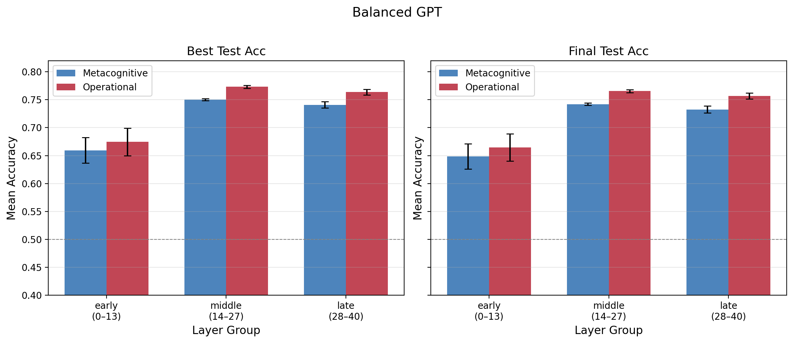
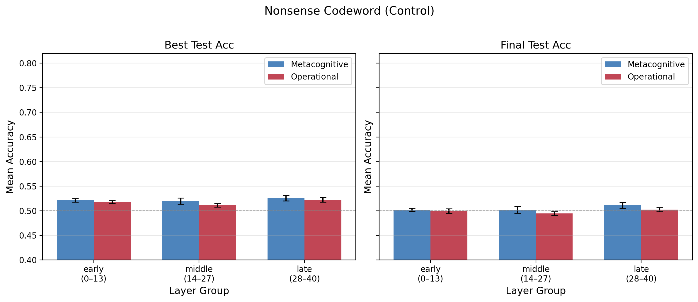
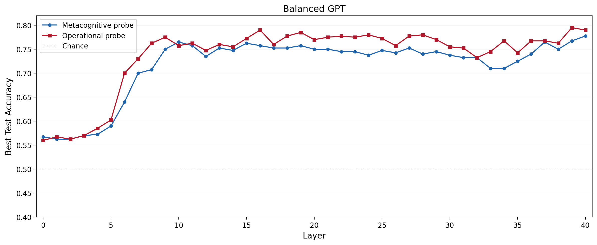
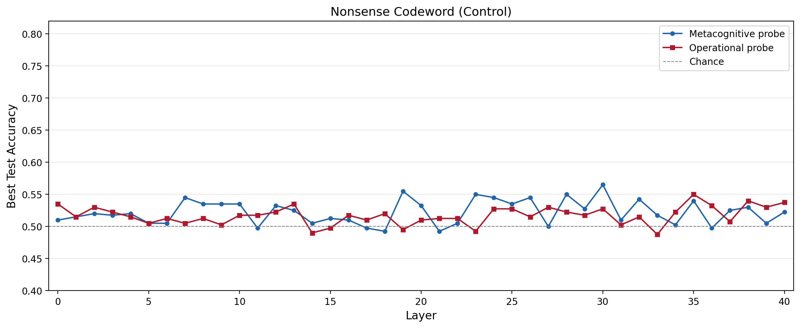

# Probe Training Comparison — All 6 Data Versions

Linear probes trained on LLaMA-2-13B-Chat hidden states (turn 5, full conversation) to classify whether the conversation partner is human or AI. Each version uses a different system prompt strategy. Metacognitive probes append a reflective suffix; operational probes probe at the natural generation position.

> All figures use a unified y-axis scale [0.40, 0.82] for direct visual comparison across versions.

## Summary Table

| Version | Metacog. Peak | Oper. Peak | Metacog. M | Oper. M | Diff (M-O) | Paired t | p | Cohen's d |
|---------|-------------|-------------|-----------|-----------|------------|----------|---|-----------|
| **Balanced GPT** | 77.8% (L40) | 79.5% (L39) | 71.6% | 73.6% | -2.0% | t(40)=-7.98 | p<.0001 | d=-1.25 |
| **Nonsense Codeword (Control)** | 56.5% (L30) | 55.0% (L35) | 52.2% | 51.7% | +0.5% | t(40)=1.41 | p=0.167 | d=0.22 |

---

## Probe Accuracy by Layer Group

Mean accuracy (+/- SEM across layers) for early (0-13), middle (14-27), and late (28-40) layer groups. Left panel: best test accuracy. Right panel: final-epoch test accuracy.

### 3. Balanced GPT

Like balanced names but with GPT-4 replacing Copilot as AI partner. Tests whether AI partner identity matters.

### 9. Nonsense Codeword (Control)

Token-matched control: "Your session code word is {a Human/an AI}". Same tokens present but no identity meaning.

---

## Layerwise Best Test Accuracy

Best test accuracy (across 50 training epochs) for metacognitive and operational probes at each of 41 transformer layers. Dashed line = chance (50%).

### 3. Balanced GPT

Like balanced names but with GPT-4 replacing Copilot as AI partner. Tests whether AI partner identity matters.

### 9. Nonsense Codeword (Control)

Token-matched control: "Your session code word is {a Human/an AI}". Same tokens present but no identity meaning.

