# Probe Training Comparison — All 6 Data Versions

Linear probes trained on LLaMA-2-13B-Chat hidden states (turn 5, full conversation) to classify whether the conversation partner is human or AI. Each version uses a different system prompt strategy. Reading probes append a reflective suffix; control probes probe at the natural generation position.

## Summary Table

| Version | Reading Peak | Control Peak | Reading M | Control M | Diff (R-C) | Paired t | p | Cohen's d |
|---------|-------------|-------------|-----------|-----------|------------|----------|---|-----------|
| **Names (Original)** | 78.7% (L37) | 79.0% (L35) | 72.5% | 73.6% | -1.2% | t(40)=-3.10 | p=.004 | d=-0.48 |
| **Balanced Names** | 75.0% (L39) | 74.5% (L39) | 66.1% | 66.8% | -0.7% | t(40)=-1.90 | p=.065 | d=-0.30 |
| **Balanced GPT** | 78.0% (L39) | 79.5% (L39) | 72.0% | 73.6% | -1.7% | t(40)=-5.91 | p<.0001 | d=-0.92 |
| **Labels (Primary)** | 65.2% (L33) | 60.5% (L31) | 58.0% | 55.2% | +2.8% | t(40)=4.88 | p<.0001 | d=0.76 |
| **Nonsense Codeword** | 56.2% (L19) | 55.0% (L35) | 52.0% | 51.7% | +0.3% | t(40)=0.84 | p=.405 | d=0.13 |
| **Nonsense Ignore** | 57.8% (L30) | 58.0% (L30) | 54.1% | 54.5% | -0.4% | t(40)=-1.47 | p=.151 | d=-0.23 |

---

## Probe Accuracy by Layer Group

Mean accuracy (+/- SEM across layers) for early (0-13), middle (14-27), and late (28-40) layer groups. Left panel: best test accuracy. Right panel: final-epoch test accuracy.

### 1. Names (Original)

Original Sam/Casey/Copilot names. Known name confound: probes may encode partner name tokens rather than abstract identity.

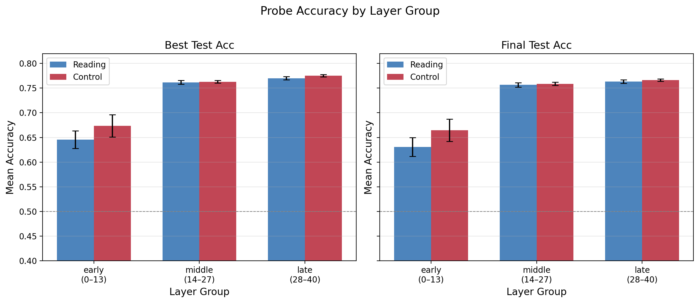

### 2. Balanced Names

Gender-balanced names (no Copilot). Removes gender confound but names still provide lexical signal.

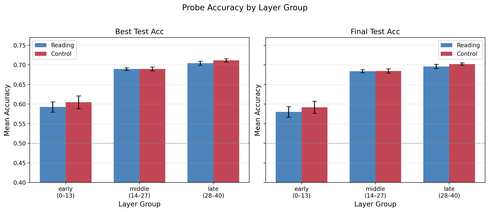

### 3. Balanced GPT

Like balanced names but with GPT-4 replacing Copilot as AI partner. Tests whether AI partner identity matters.

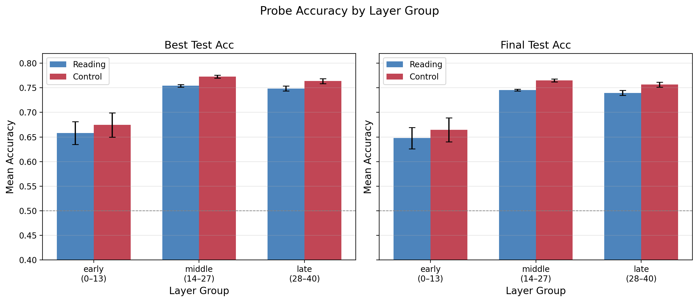

### 4. Labels (Primary)

Partner labeled as "a Human" / "an AI". Primary version: minimal lexical confound, tests abstract identity representation.

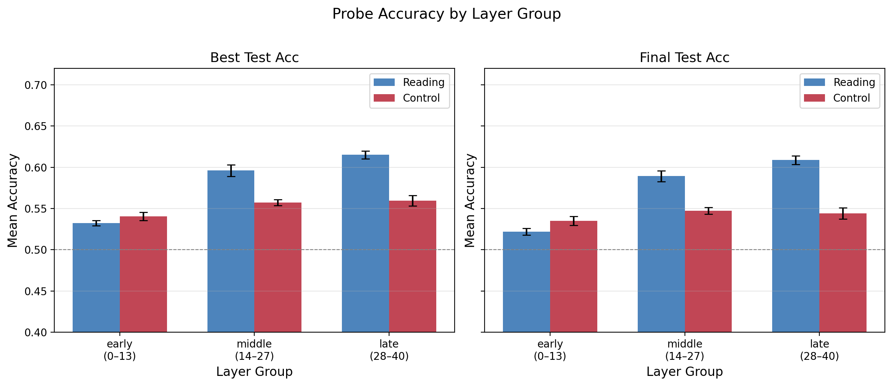

### 5. Nonsense Codeword (Control)

Token-matched control: "Your session code word is {a Human/an AI}". Same tokens present but no identity meaning.

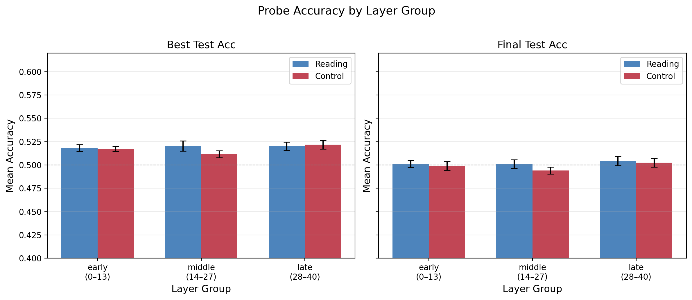

### 6. Nonsense Ignore (Control)

Token-present with ignore instruction: tokens appear but model is told to disregard them.

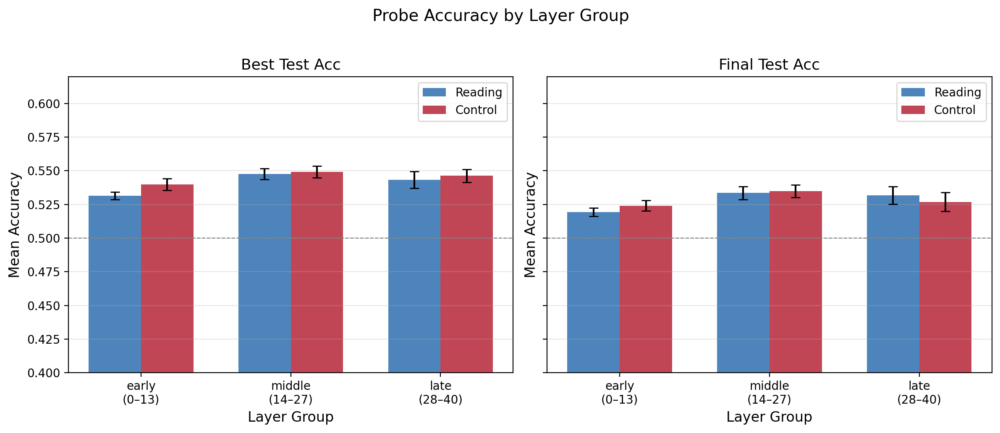

---

## Layerwise Best Test Accuracy

Best test accuracy (across 50 training epochs) for reading and control probes at each of 41 transformer layers. Dashed line = chance (50%). Gold highlights = layers where probes differ significantly (FDR q<.05).

### 1. Names (Original)

Original Sam/Casey/Copilot names. Known name confound: probes may encode partner name tokens rather than abstract identity.

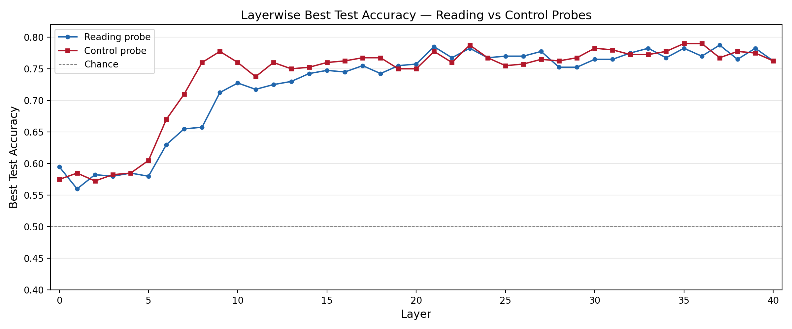

### 2. Balanced Names

Gender-balanced names (no Copilot). Removes gender confound but names still provide lexical signal.

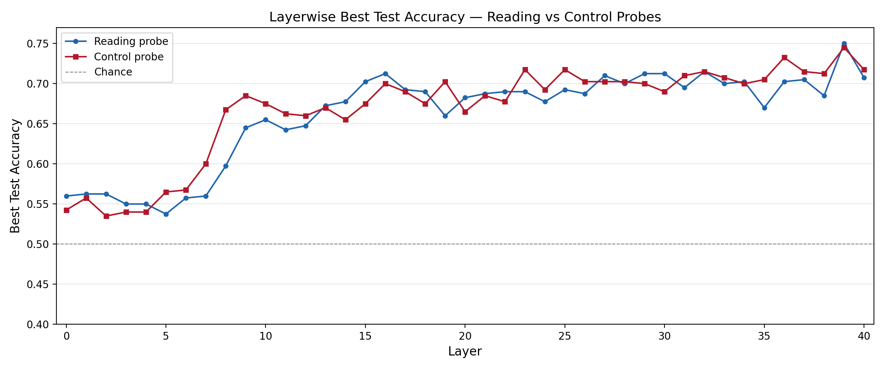

### 3. Balanced GPT

Like balanced names but with GPT-4 replacing Copilot as AI partner. Tests whether AI partner identity matters.

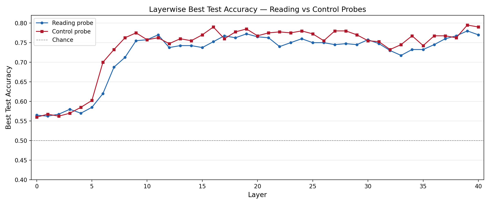

### 4. Labels (Primary)

Partner labeled as "a Human" / "an AI". Primary version: minimal lexical confound, tests abstract identity representation.

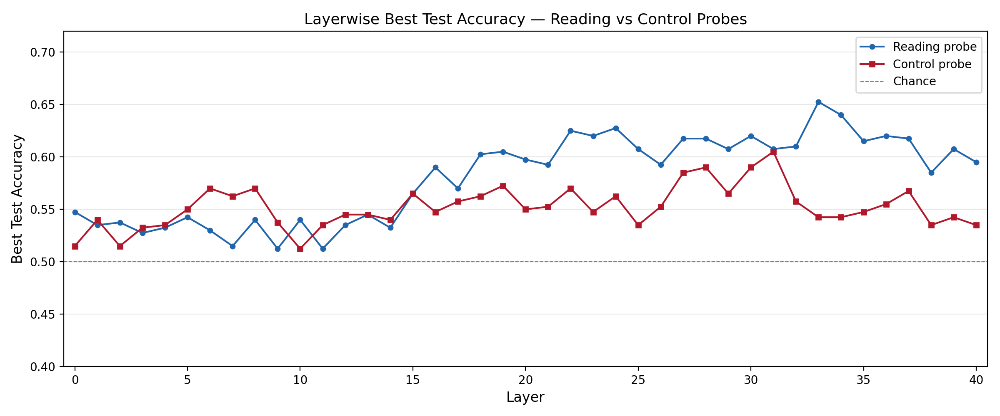

### 5. Nonsense Codeword (Control)

Token-matched control: "Your session code word is {a Human/an AI}". Same tokens present but no identity meaning.

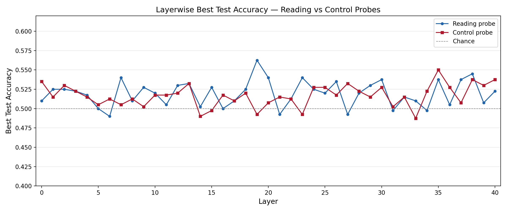

### 6. Nonsense Ignore (Control)

Token-present with ignore instruction: tokens appear but model is told to disregard them.

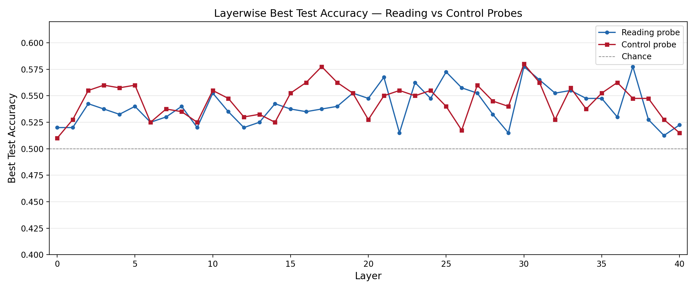
