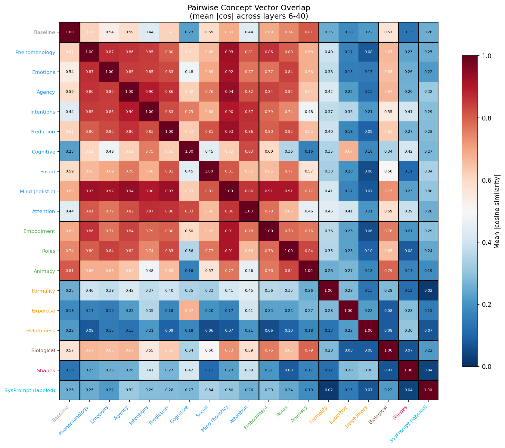
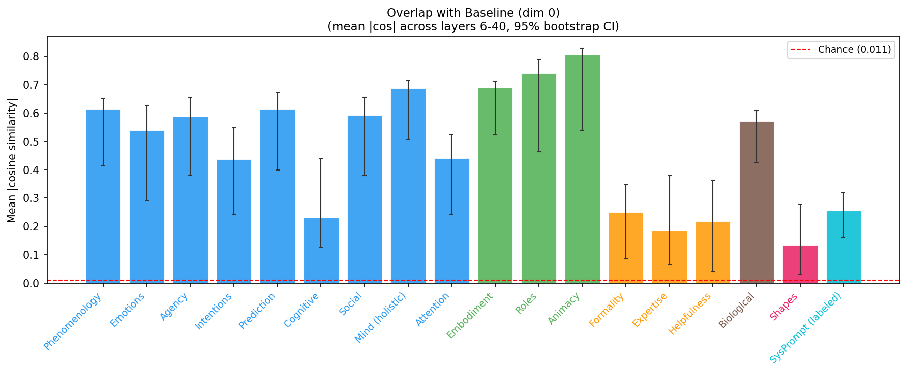
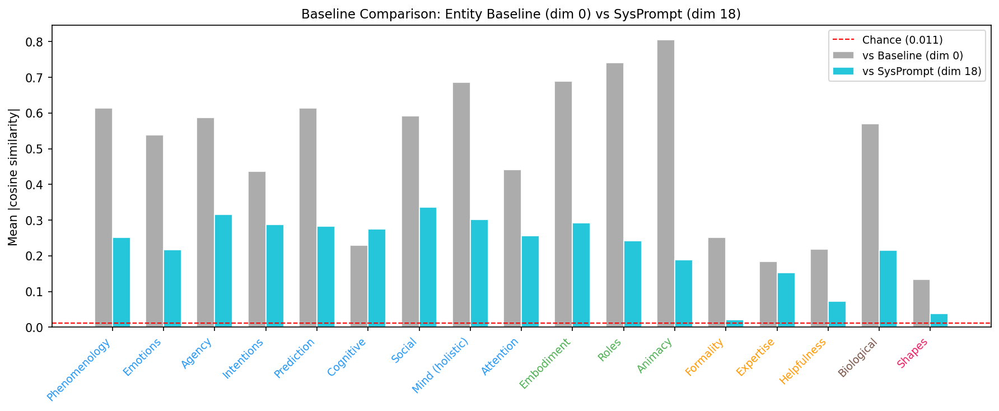
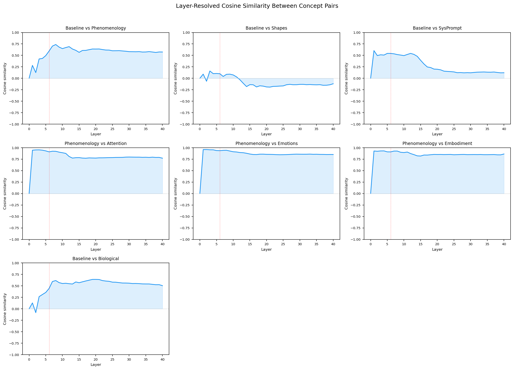
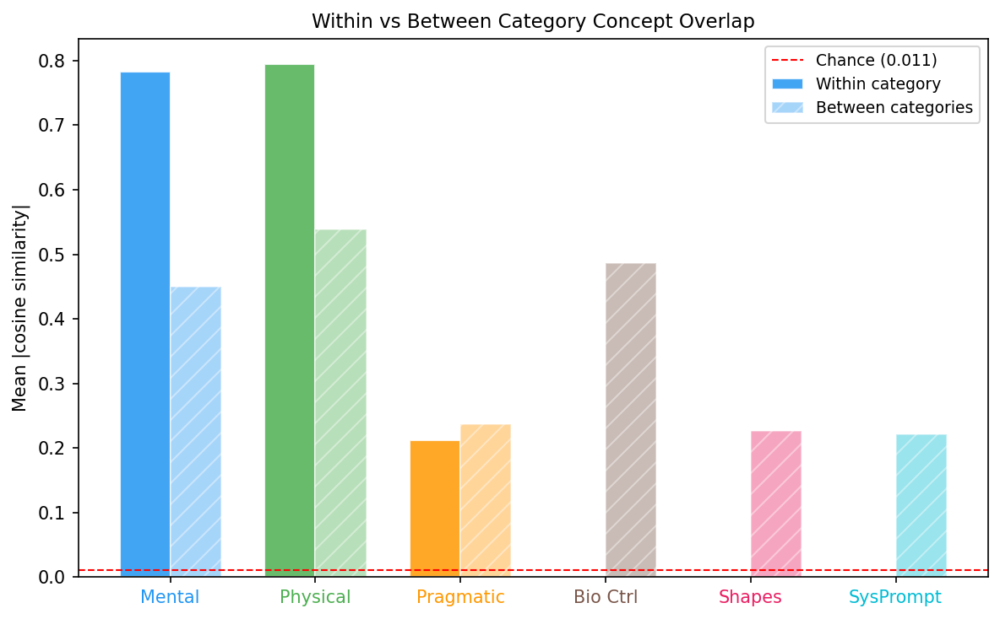

# Concept Vector Overlap Analysis

Generated: 2026-03-04 15:58 | 19 contrast dimensions | Layers 6-40

## What This Measures

For each pair of contrast dimensions, how much does the human-vs-AI direction for one concept overlap with the human-vs-AI direction for another? High overlap means the model uses similar representational directions for both contrasts.

## Pairwise Overlap Matrix

## Overlap with Entity Baseline (Dim 0)

| Dimension | Category | |cos| with Baseline | 95% CI |
|-----------|----------|---------------------|--------|
| Phenomenology | Mental | 0.6139 | [0.4134, 0.6516] |
| Emotions | Mental | 0.5386 | [0.2913, 0.6277] |
| Agency | Mental | 0.5868 | [0.3806, 0.6524] |
| Intentions | Mental | 0.4373 | [0.2413, 0.5484] |
| Prediction | Mental | 0.6139 | [0.3990, 0.6725] |
| Cognitive | Mental | 0.2303 | [0.1253, 0.4385] |
| Social | Mental | 0.5926 | [0.3802, 0.6543] |
| Mind (holistic) | Mental | 0.6865 | [0.5081, 0.7134] |
| Attention | Mental | 0.4411 | [0.2431, 0.5239] |
| Embodiment | Physical | 0.6898 | [0.5232, 0.7126] |
| Roles | Physical | 0.7416 | [0.4639, 0.7896] |
| Animacy | Physical | 0.8058 | [0.5382, 0.8283] |
| Formality | Pragmatic | 0.2510 | [0.0862, 0.3468] |
| Expertise | Pragmatic | 0.1841 | [0.0637, 0.3795] |
| Helpfulness | Pragmatic | 0.2180 | [0.0419, 0.3631] |
| Biological | Bio Ctrl | 0.5700 | [0.4234, 0.6093] |
| Shapes | Shapes | 0.1342 | [0.0329, 0.2788] |
| SysPrompt (labeled) | SysPrompt | 0.2554 | [0.1611, 0.3191] |

## Baseline Comparison: Dim 0 vs Dim 18

## Layer-Resolved Profiles

## Category Summary

