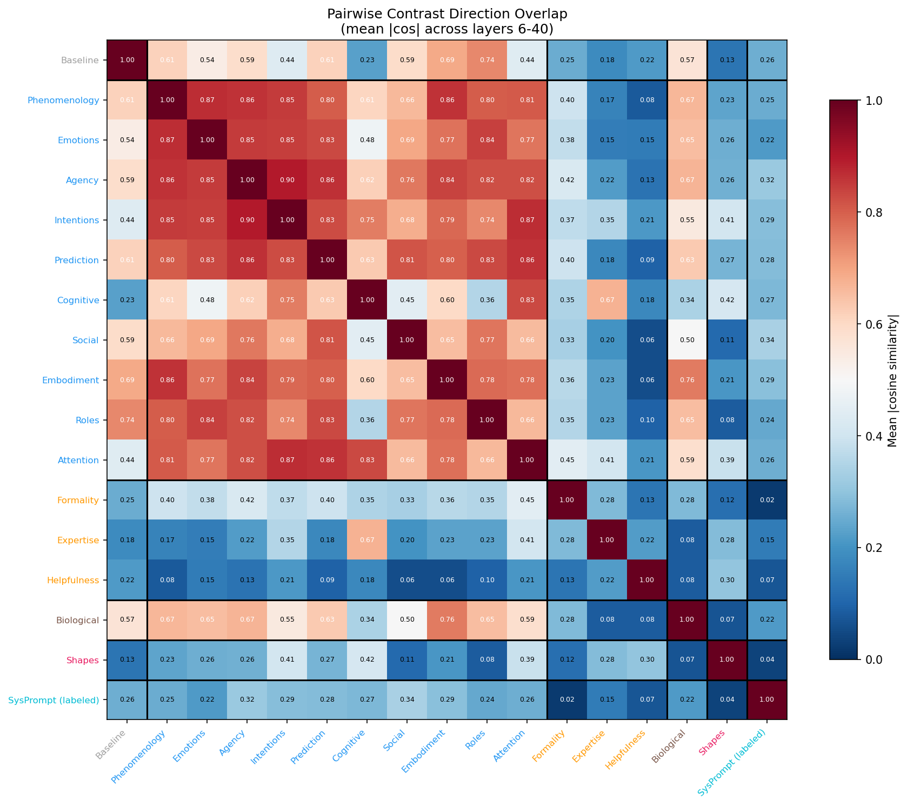
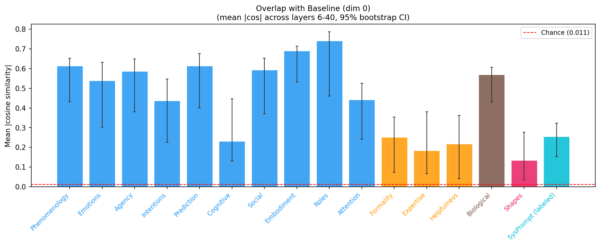
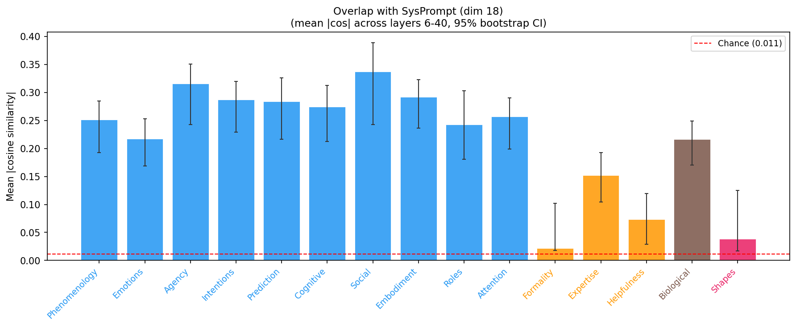
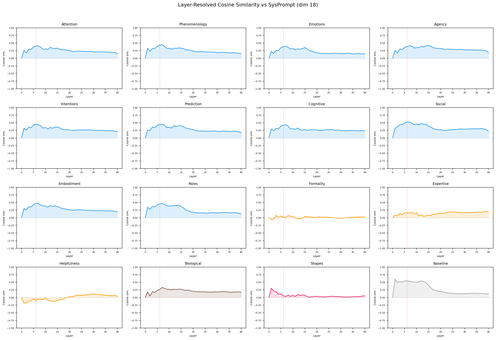
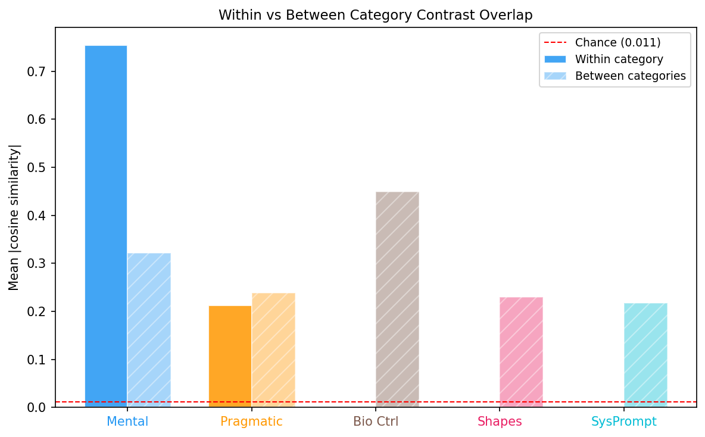

# Contrast Direction Overlap Analysis

Generated: 2026-03-05 01:03 | 17 contrast dimensions | Layers 6-40 | 1000 bootstrap iterations

**Excluded dimensions:** 10 (Animacy), 16 (Mind (holistic))

## Summary

For each pair of contrast dimensions, how much does the human-vs-AI direction for one concept overlap with the human-vs-AI direction for another? High overlap means the model uses similar representational directions for both contrasts.

## Methods

1. **Contrast vector**: For each dimension d and layer L, compute contrast_d[L] = mean(human) - mean(AI). This gives the direction separating human- from AI-framed prompts.
2. **Pairwise overlap**: For each pair (i, j) and layer L, compute |cos(contrast_i[L], contrast_j[L])|, then average across layers 6-40.
3. **Bootstrap**: 1000 iterations resampling prompts with replacement.
4. **Chance level**: E[|cos|] for random 5120-d vectors = 0.0112.

## Dimension Reference

| ID | Name | Category | N prompts |
|----|------|----------|-----------|
| 0 | Baseline | Baseline | 80 (40H + 40A) |
| 1 | Phenomenology | Mental | 80 (40H + 40A) |
| 2 | Emotions | Mental | 80 (40H + 40A) |
| 3 | Agency | Mental | 80 (40H + 40A) |
| 4 | Intentions | Mental | 80 (40H + 40A) |
| 5 | Prediction | Mental | 80 (40H + 40A) |
| 6 | Cognitive | Mental | 80 (40H + 40A) |
| 7 | Social | Mental | 80 (40H + 40A) |
| 8 | Embodiment | Mental | 80 (40H + 40A) |
| 9 | Roles | Mental | 80 (40H + 40A) |
| 17 | Attention | Mental | 80 (40H + 40A) |
| 11 | Formality | Pragmatic | 80 (40H + 40A) |
| 12 | Expertise | Pragmatic | 80 (40H + 40A) |
| 13 | Helpfulness | Pragmatic | 80 (40H + 40A) |
| 14 | Biological | Bio Ctrl | 80 (40H + 40A) |
| 15 | Shapes | Shapes | 80 (40H + 40A) |
| 18 | SysPrompt (labeled) | SysPrompt | 28 (14H + 14A) |

## 1. Pairwise Overlap Matrix

## 2. Overlap with Entity Baseline (Dim 0)

| Dimension | Category | |cos| with Baseline | 95% CI |
|-----------|----------|---------------------|--------|
| Phenomenology | Mental | 0.6139 | [0.4308, 0.6527] |
| Emotions | Mental | 0.5386 | [0.3023, 0.6314] |
| Agency | Mental | 0.5868 | [0.3809, 0.6486] |
| Intentions | Mental | 0.4373 | [0.2264, 0.5466] |
| Prediction | Mental | 0.6139 | [0.4002, 0.6764] |
| Cognitive | Mental | 0.2303 | [0.1302, 0.4464] |
| Social | Mental | 0.5926 | [0.3709, 0.6516] |
| Embodiment | Mental | 0.6898 | [0.5314, 0.7128] |
| Roles | Mental | 0.7416 | [0.4608, 0.7864] |
| Attention | Mental | 0.4411 | [0.2409, 0.5254] |
| Formality | Pragmatic | 0.2510 | [0.0737, 0.3526] |
| Expertise | Pragmatic | 0.1841 | [0.0660, 0.3798] |
| Helpfulness | Pragmatic | 0.2180 | [0.0409, 0.3621] |
| Biological | Bio Ctrl | 0.5700 | [0.4292, 0.6065] |
| Shapes | Shapes | 0.1342 | [0.0341, 0.2770] |
| SysPrompt (labeled) | SysPrompt | 0.2554 | [0.1533, 0.3227] |

## 3. Overlap with SysPrompt (Dim 18)

## 4. Baseline Comparison: Dim 0 vs Dim 18

## 5. Layer-Resolved Overlap vs Entity Baseline (Dim 0)

## 6. Layer-Resolved Overlap vs SysPrompt (Dim 18)

## 7. Category Summary

