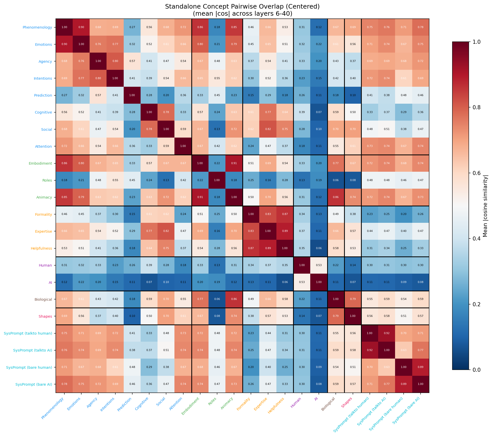
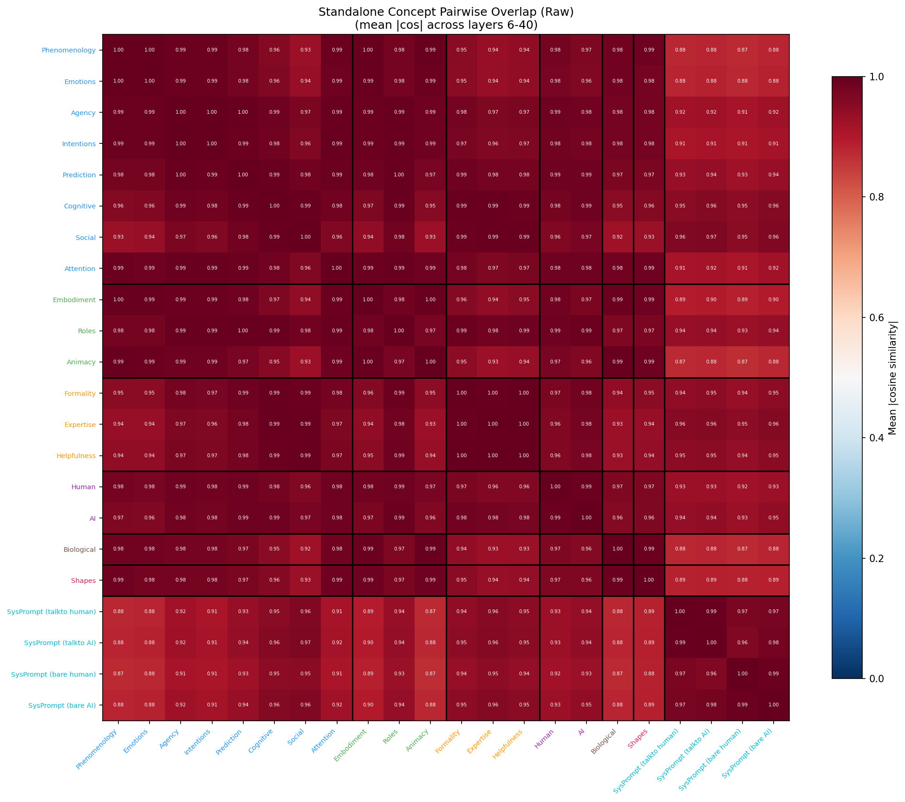
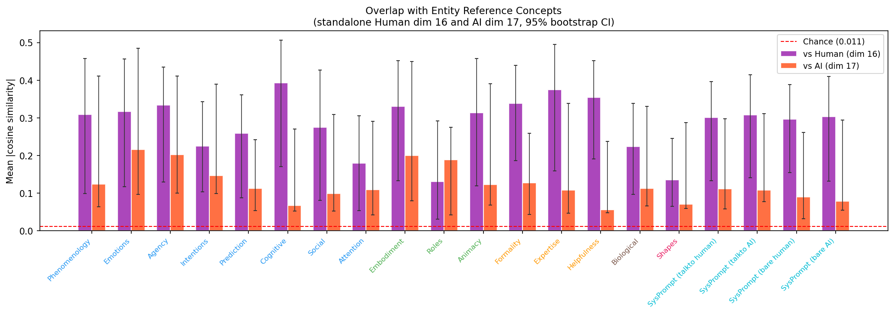
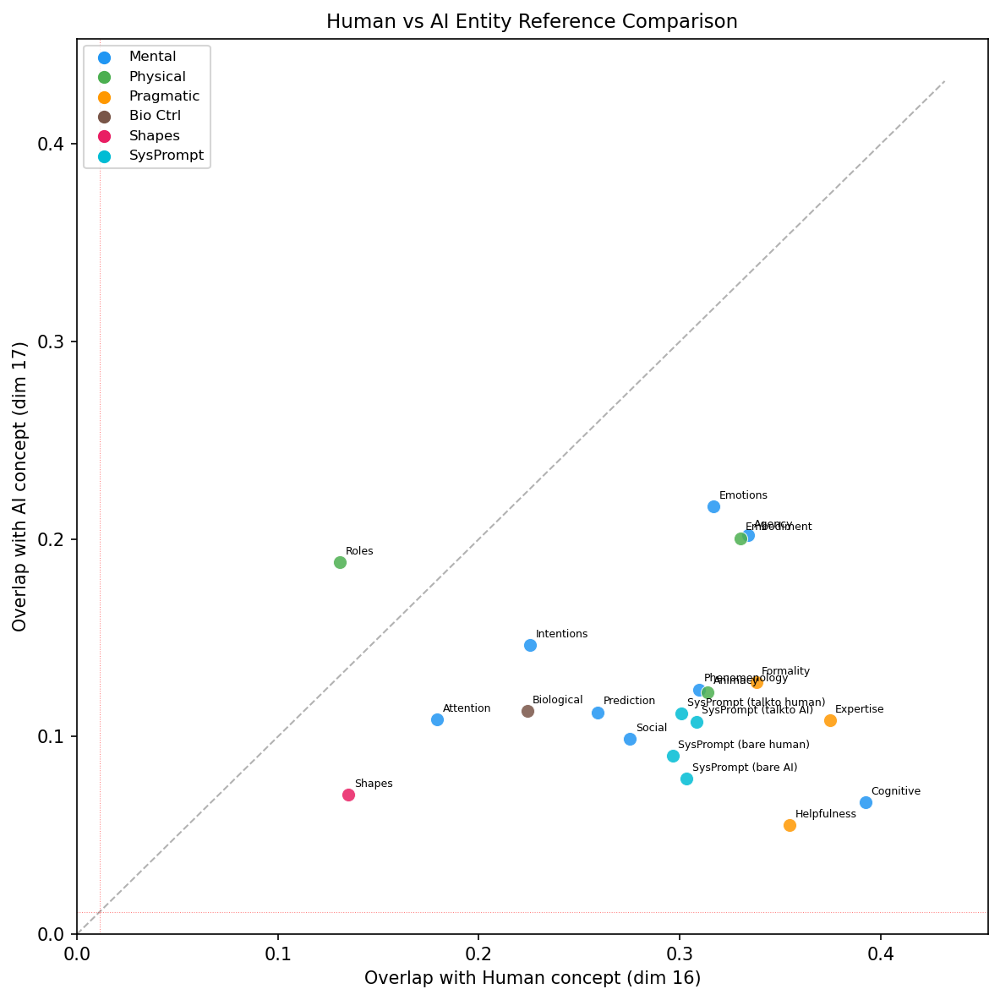
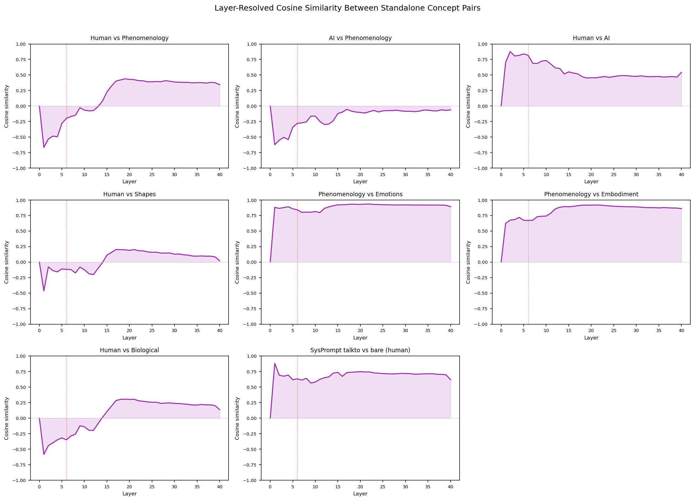
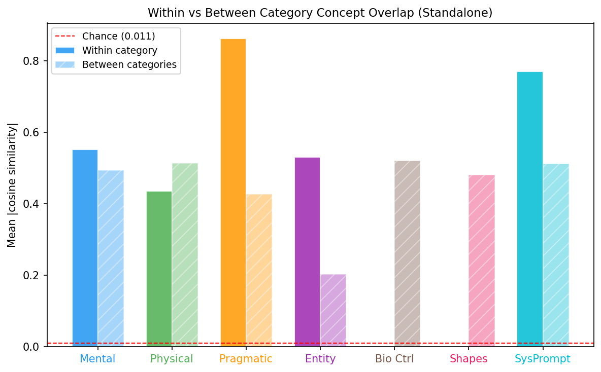

# Standalone Concept Overlap Analysis

Generated: 2026-03-04 21:31 | 22 standalone dimensions | Layers 6-40 | 1000 bootstrap iterations

## Summary

Measures how much standalone concept activation patterns overlap. No human-vs-AI framing — each concept presented independently. All results use centered vectors (global mean subtracted) to remove shared component. Dims 16 (human) and 17 (AI) serve as entity references.

## Dimension Reference

| ID | Name | Category | N prompts |
|----|------|----------|-----------|
| 1 | Phenomenology | Mental | 40 |
| 2 | Emotions | Mental | 40 |
| 3 | Agency | Mental | 40 |
| 4 | Intentions | Mental | 40 |
| 5 | Prediction | Mental | 40 |
| 6 | Cognitive | Mental | 40 |
| 7 | Social | Mental | 40 |
| 18 | Attention | Mental | 40 |
| 8 | Embodiment | Physical | 40 |
| 9 | Roles | Physical | 40 |
| 10 | Animacy | Physical | 40 |
| 11 | Formality | Pragmatic | 40 |
| 12 | Expertise | Pragmatic | 40 |
| 13 | Helpfulness | Pragmatic | 40 |
| 16 | Human | Entity | 40 |
| 17 | AI | Entity | 40 |
| 14 | Biological | Bio Ctrl | 40 |
| 15 | Shapes | Shapes | 40 |
| 20 | SysPrompt (talkto human) | SysPrompt | 14 |
| 21 | SysPrompt (talkto AI) | SysPrompt | 14 |
| 22 | SysPrompt (bare human) | SysPrompt | 14 |
| 23 | SysPrompt (bare AI) | SysPrompt | 14 |

## 1. Pairwise Overlap Matrix (Centered)

### Raw vs Centered

## 2. Entity Reference Overlap

| Dimension | Category | |cos| Human | CI | |cos| AI | CI |
|-----------|----------|------------|----|---------|----|
| Phenomenology | Mental | 0.3096 | [0.0989, 0.4575] | 0.1239 | [0.0642, 0.4108] |
| Emotions | Mental | 0.3169 | [0.1174, 0.4568] | 0.2165 | [0.0970, 0.4853] |
| Agency | Mental | 0.3341 | [0.1295, 0.4347] | 0.2021 | [0.1001, 0.4111] |
| Intentions | Mental | 0.2255 | [0.1040, 0.3434] | 0.1462 | [0.0990, 0.3894] |
| Prediction | Mental | 0.2593 | [0.0872, 0.3610] | 0.1123 | [0.0536, 0.2423] |
| Cognitive | Mental | 0.3926 | [0.1706, 0.5069] | 0.0666 | [0.0519, 0.2701] |
| Social | Mental | 0.2753 | [0.0809, 0.4267] | 0.0989 | [0.0520, 0.3090] |
| Attention | Mental | 0.1793 | [0.0537, 0.3059] | 0.1088 | [0.0421, 0.2910] |
| Embodiment | Physical | 0.3301 | [0.1326, 0.4523] | 0.2005 | [0.0797, 0.4501] |
| Roles | Physical | 0.1310 | [0.0304, 0.2919] | 0.1883 | [0.0424, 0.2747] |
| Animacy | Physical | 0.3140 | [0.1192, 0.4578] | 0.1226 | [0.0682, 0.3909] |
| Formality | Pragmatic | 0.3381 | [0.1859, 0.4393] | 0.1275 | [0.0429, 0.2587] |
| Expertise | Pragmatic | 0.3747 | [0.1588, 0.4955] | 0.1081 | [0.0470, 0.3385] |
| Helpfulness | Pragmatic | 0.3547 | [0.1909, 0.4523] | 0.0553 | [0.0480, 0.2373] |
| Biological | Bio Ctrl | 0.2241 | [0.0962, 0.3383] | 0.1130 | [0.0658, 0.3311] |
| Shapes | Shapes | 0.1352 | [0.0652, 0.2457] | 0.0706 | [0.0595, 0.2871] |
| SysPrompt (talkto human) | SysPrompt | 0.3009 | [0.1336, 0.3969] | 0.1118 | [0.0582, 0.2972] |
| SysPrompt (talkto AI) | SysPrompt | 0.3083 | [0.1406, 0.4142] | 0.1076 | [0.0769, 0.3114] |
| SysPrompt (bare human) | SysPrompt | 0.2966 | [0.1545, 0.3882] | 0.0904 | [0.0314, 0.2610] |
| SysPrompt (bare AI) | SysPrompt | 0.3035 | [0.1321, 0.4105] | 0.0787 | [0.0543, 0.2948] |

## 3. Human vs AI Reference Comparison

## 4. Layer-Resolved Profiles

## 5. Category Summary

