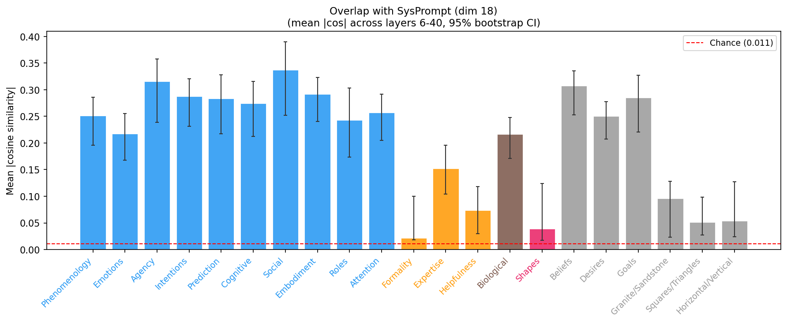
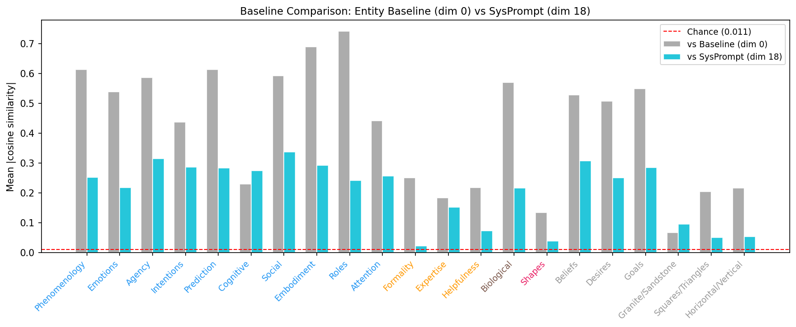

# Contrast Direction Overlap Analysis

Generated: 2026-03-08 21:01 | 23 contrast dimensions | Layers 6-40 | 1000 bootstrap iterations

**Excluded dimensions:** 10 (Animacy), 16 (Mind (holistic)), 29 (dim_29)

## Summary

For each pair of contrast dimensions, how much does the human-vs-AI direction for one concept overlap with the human-vs-AI direction for another? High overlap means the model uses similar representational directions for both contrasts.

## Methods

1. **Contrast vector**: For each dimension d and layer L, compute contrast_d[L] = mean(human) - mean(AI). This gives the direction separating human- from AI-framed prompts.
2. **Pairwise overlap**: For each pair (i, j) and layer L, compute |cos(contrast_i[L], contrast_j[L])|, then average across layers 6-40.
3. **Bootstrap**: 1000 iterations resampling prompts with replacement.
4. **Chance level**: E[|cos|] for random 5120-d vectors = 0.0112.

## Dimension Reference

| ID | Name | Category | N prompts |
|----|------|----------|-----------|
| 0 | Baseline | Baseline | 80 (40H + 40A) |
| 1 | Phenomenology | Mental | 80 (40H + 40A) |
| 2 | Emotions | Mental | 80 (40H + 40A) |
| 3 | Agency | Mental | 80 (40H + 40A) |
| 4 | Intentions | Mental | 80 (40H + 40A) |
| 5 | Prediction | Mental | 80 (40H + 40A) |
| 6 | Cognitive | Mental | 80 (40H + 40A) |
| 7 | Social | Mental | 80 (40H + 40A) |
| 8 | Embodiment | Mental | 80 (40H + 40A) |
| 9 | Roles | Mental | 80 (40H + 40A) |
| 17 | Attention | Mental | 80 (40H + 40A) |
| 11 | Formality | Pragmatic | 80 (40H + 40A) |
| 12 | Expertise | Pragmatic | 80 (40H + 40A) |
| 13 | Helpfulness | Pragmatic | 80 (40H + 40A) |
| 14 | Biological | Bio Ctrl | 80 (40H + 40A) |
| 15 | Shapes | Shapes | 80 (40H + 40A) |
| 18 | SysPrompt (labeled) | SysPrompt | 28 (14H + 14A) |
| 25 | Beliefs | Other | 80 (40H + 40A) |
| 26 | Desires | Other | 80 (40H + 40A) |
| 27 | Goals | Other | 80 (40H + 40A) |
| 30 | Granite/Sandstone | Other | 80 (40H + 40A) |
| 31 | Squares/Triangles | Other | 80 (40H + 40A) |
| 32 | Horizontal/Vertical | Other | 80 (40H + 40A) |

## 1. Pairwise Overlap Matrix

## 2. Overlap with Entity Baseline (Dim 0)

| Dimension | Category | |cos| with Baseline | 95% CI |
|-----------|----------|---------------------|--------|
| Phenomenology | Mental | 0.6139 | [0.4366, 0.6494] |
| Emotions | Mental | 0.5386 | [0.2846, 0.6344] |
| Agency | Mental | 0.5868 | [0.3991, 0.6529] |
| Intentions | Mental | 0.4373 | [0.2457, 0.5363] |
| Prediction | Mental | 0.6139 | [0.4015, 0.6635] |
| Cognitive | Mental | 0.2303 | [0.1271, 0.4481] |
| Social | Mental | 0.5926 | [0.3707, 0.6561] |
| Embodiment | Mental | 0.6898 | [0.5140, 0.7149] |
| Roles | Mental | 0.7416 | [0.4685, 0.7866] |
| Attention | Mental | 0.4411 | [0.2500, 0.5285] |
| Formality | Pragmatic | 0.2510 | [0.0700, 0.3488] |
| Expertise | Pragmatic | 0.1841 | [0.0662, 0.3723] |
| Helpfulness | Pragmatic | 0.2180 | [0.0389, 0.3776] |
| Biological | Bio Ctrl | 0.5700 | [0.4201, 0.6037] |
| Shapes | Shapes | 0.1342 | [0.0319, 0.2744] |
| SysPrompt (labeled) | SysPrompt | 0.2554 | [0.1558, 0.3186] |
| Beliefs | Other | 0.5285 | [0.2581, 0.6237] |
| Desires | Other | 0.5074 | [0.3477, 0.5690] |
| Goals | Other | 0.5489 | [0.3306, 0.6252] |
| Granite/Sandstone | Other | 0.0676 | [0.0254, 0.3075] |
| Squares/Triangles | Other | 0.2038 | [0.0332, 0.3787] |
| Horizontal/Vertical | Other | 0.2167 | [0.0335, 0.3767] |

## 3. Overlap with SysPrompt (Dim 18)

## 4. Baseline Comparison: Dim 0 vs Dim 18

## 5. Layer-Resolved Overlap vs Entity Baseline (Dim 0)

## 6. Layer-Resolved Overlap vs SysPrompt (Dim 18)

## 7. Category Summary

