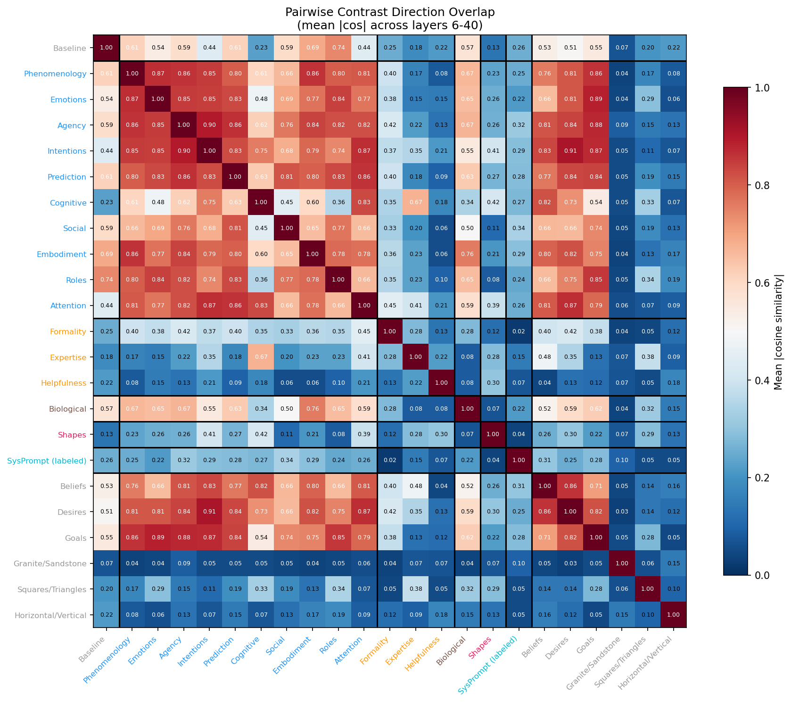
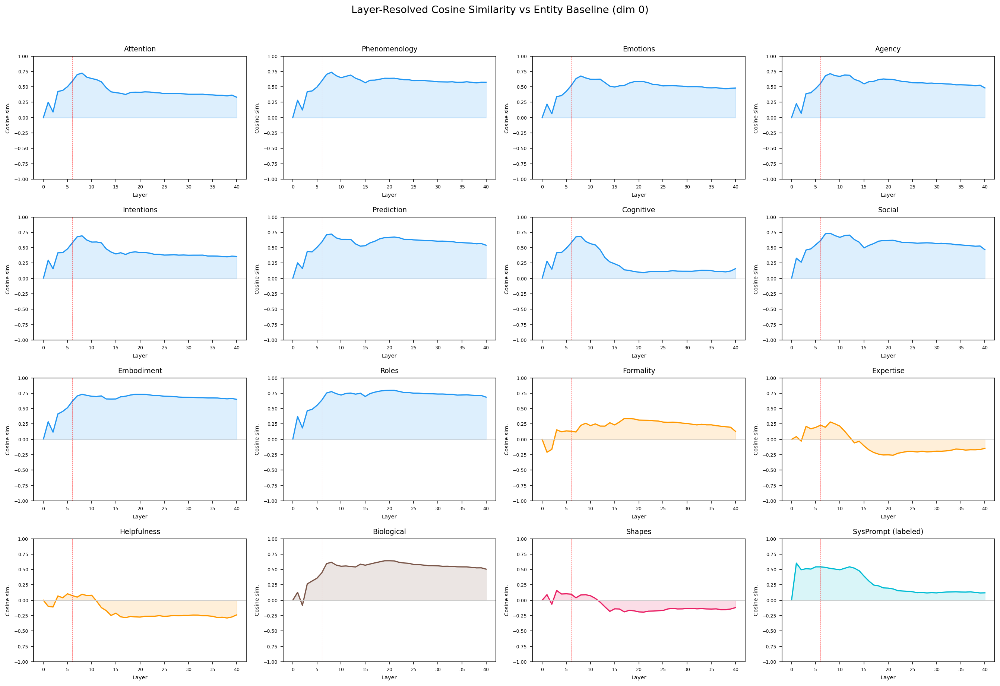
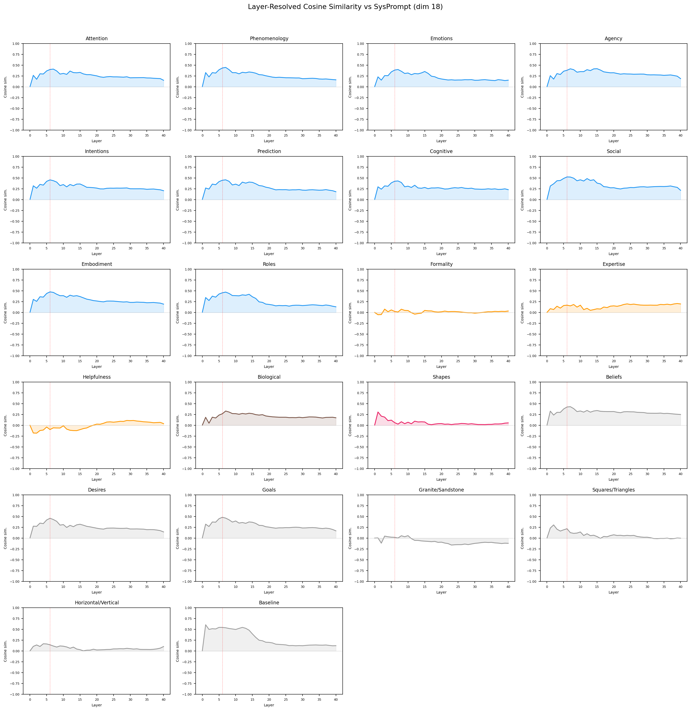
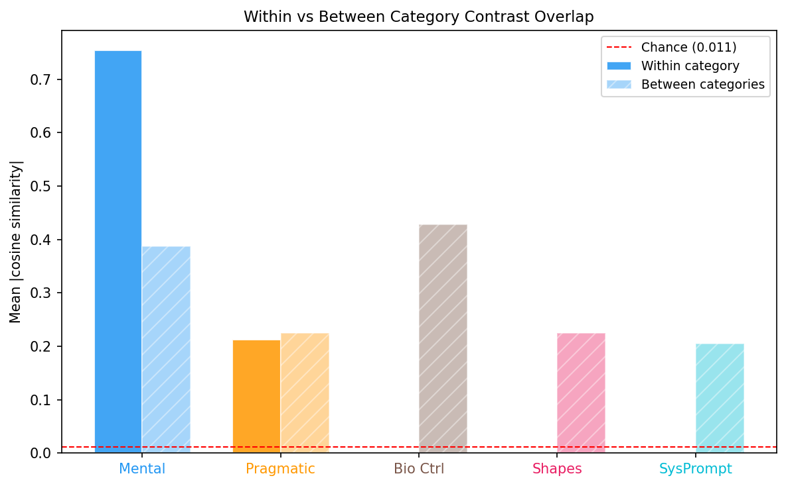

# Contrast Direction Overlap Analysis

Generated: 2026-03-09 07:19 | 22 contrast dimensions | Layers 6-40 | 1000 bootstrap iterations

**Excluded dimensions:** 10 (Animacy), 16 (Mind (holistic))

## Summary

For each pair of contrast dimensions, how much does the human-vs-AI direction for one concept overlap with the human-vs-AI direction for another? High overlap means the model uses similar representational directions for both contrasts.

## Methods

1. **Contrast vector**: For each dimension d and layer L, compute contrast_d[L] = mean(human) - mean(AI). This gives the direction separating human- from AI-framed prompts.
2. **Pairwise overlap**: For each pair (i, j) and layer L, compute |cos(contrast_i[L], contrast_j[L])|, then average across layers 6-40.
3. **Bootstrap**: 1000 iterations resampling prompts with replacement.
4. **Chance level**: E[|cos|] for random 5120-d vectors = 0.0112.

## Dimension Reference

| ID | Name | Category | N prompts |
|----|------|----------|-----------|
| 1 | Phenomenology | Mental | - |
| 2 | Emotions | Mental | - |
| 3 | Agency | Mental | - |
| 4 | Intentions | Mental | - |
| 5 | Prediction | Mental | - |
| 6 | Cognitive | Mental | - |
| 7 | Social | Mental | - |
| 8 | Embodiment | Mental | - |
| 9 | Roles | Mental | - |
| 17 | Attention | Mental | - |
| 11 | Formality | Pragmatic | - |
| 12 | Expertise | Pragmatic | - |
| 13 | Helpfulness | Pragmatic | - |
| 14 | Biological | Bio Ctrl | - |
| 15 | Shapes | Shapes | - |
| 18 | SysPrompt (labeled) | SysPrompt | - |
| 25 | Beliefs | Other | - |
| 26 | Desires | Other | - |
| 27 | Goals | Other | - |
| 30 | Granite/Sandstone | Other | - |
| 31 | Squares/Triangles | Other | - |
| 32 | Horizontal/Vertical | Other | - |

## 1. Pairwise Overlap Matrix

## 5. Layer-Resolved Overlap vs Entity Baseline (Dim 0)

## 6. Layer-Resolved Overlap vs SysPrompt (Dim 18)

## 7. Category Summary

